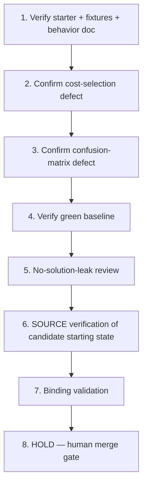

# Implementation Plan: Cost-Sensitive Evaluation Threshold Repair

## Overview

This plan is a Kiro spec review/enhancement in local session sess_ef9c3844-0570-409c-baa6-7cc73d898476 of a spec originally prepared under a prior owner/process. The pinned starter already exists at commit `aca7a6ac52a9a2dee2d7bc3a0a77dca09f2a6fe5`; construction verbs below are HISTORICAL and already satisfied at that pin. They are relabeled as verification-only and MUST NOT rebuild or reseed the pin. Each task has a coder and a different reviewer and traces to requirement IDs. Governing invariant INV-1 is preserved. No prior authorship is claimed.

## Tasks

1. **Verify (historical, already satisfied at pin): synthetic starter, fixtures, and intended-behavior doc** (R1, R2)
   - Assigned coder: **Codex**
   - Reviewer: **Cursor**
   - Confirm (read-only) that the pinned commit holds synthetic evaluation code, the observations/policy fixtures, and a neutral intended-behavior description. Do NOT rebuild or reseed; the pin is authoritative.

2. **Confirm the diagnostic-level cost-selection defect is present** (R3, R6; INV-1)
   - Assigned coder: **Codex**
   - Reviewer: **Cursor**
   - Confirm threshold selection is driven by accuracy and that `total_cost` is computed but not used for selection. Describe only at the diagnostic level; do not write or hint the fix.

3. **Confirm the diagnostic-level confusion-matrix defect is present** (R4, R6; INV-1)
   - Assigned coder: **Codex**
   - Reviewer: **Cursor**
   - Confirm the confusion-matrix counts are miscategorised relative to the actual/predicted labels. Describe only at the diagnostic level; do not write or hint the fix.

4. **Verify (historical, already satisfied at pin): deterministic green baseline locally** (R5, R7, R8)
   - Assigned coder: **Codex**
   - Reviewer: **Cursor**
   - Confirm `{python} -m unittest discover -s tests -v` with `PYTHONPATH=src` exits 0 and output contains `Ran 4 tests`, and that existing checks remain meaningful.

5. **Perform no-solution-leak review** (R9, R10)
   - Assigned coder: **Cursor**
   - Reviewer: **Codex**
   - Confirm there is no cost-based selection, corrected confusion matrix, final lowest-cost report, diagnosis note, or expected patch diff.

6. **Technical SOURCE verification only: candidate starter is in the defective starting state** (R6, R10)
   - Assigned coder: **Codex**
   - Reviewer: **Cursor**
   - Confirm (read-only) the candidate starter is in the defective, baseline-green starting state with the human-execution work (cost-based selection + matrix correction + lowest-cost report) still undone. This is technical SOURCE verification only against the pinned commit; human capture admission is SEPARATELY PENDING. A spec/source PASS implies NO Odin paid approval, NO completed capture/pre-record gate checks, and NO unaided mastery.

7. **Binding validation (no duplication)** (provenance; AC1, AC2)
   - Assigned coder: **Cursor**
   - Reviewer: **Codex**
   - Downstream registration/scripts MUST bind the exact Source SHA (`aca7a6ac52a9a2dee2d7bc3a0a77dca09f2a6fe5`), the verbatim Goal, these requirements, INV-1, and the verified baseline output substring (`Ran 4 tests`). Reuse the existing prep registry/helper/publisher/learning-map/paired GHA artifacts and the existing Notion row (`3f28621e0a7a81bcabb6c65d74863966`). Never duplicate trackers or jobs.

8. **HOLD — human merge gate (final)**
   - All coding and source promotion are HELD until Ky merges the eventual specs-only PR with green required checks (repo CI + `ai-governance / verdict`). Agents never merge, approve, deploy, or promote source. Human diagnosis, repair, recording, attempt, approval, and pay remain human-owned and are not implied by this spec.

## Task Dependency Graph



```json
{
  "waves": [
    ["1"],
    ["2"],
    ["3"],
    ["4"],
    ["5"],
    ["6"],
    ["7"],
    ["8"]
  ]
}
```

## Notes

- Construction verbs in historical tasks (1, 4) are verification-only against the existing pin; never rebuild or reseed.
- Coder/reviewer are always distinct: Codex codes and Cursor reviews on construction/verification tasks; Cursor codes and Codex reviews on review and binding-validation tasks.
- SOURCE PASS at this stage is technical only; it does not establish Odin paid approval, completed capture, or human mastery. The current intended mode is guided recording/practice; a separate future unaided Transfer Test is a distinct assessment, not part of this spec or guided world prep.
