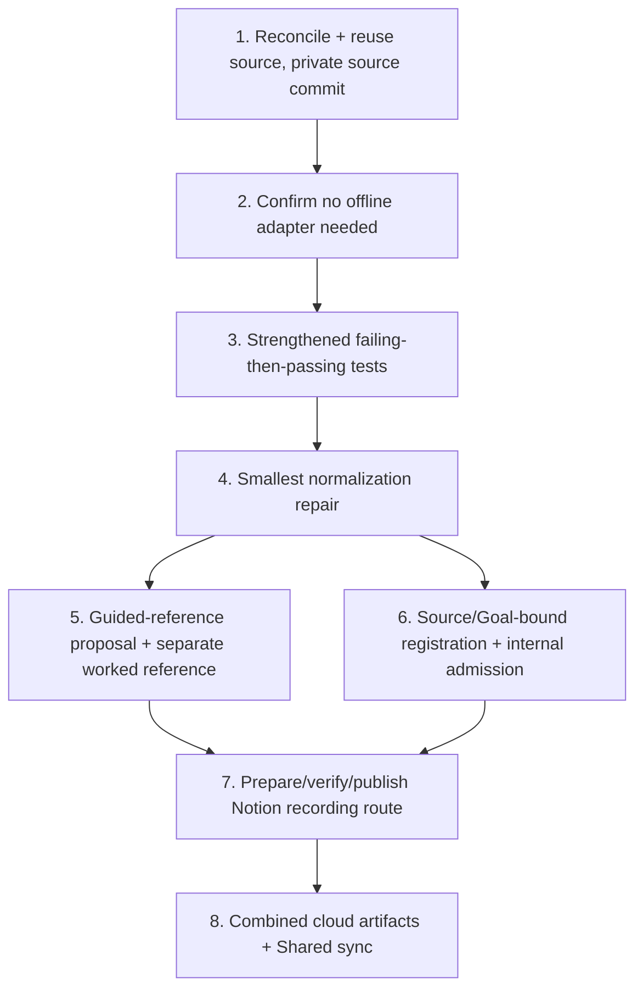

# Implementation Plan: Exact-Match Grader Normalization False-Positive Repair

## Overview

This is the FUTURE real implementation plan that runs ONLY after an actual Kiro review PASS and Ky's human merge of the new canonical 18-record spec PR to `main`. THIS Kiro session executes none of it — no code, no tests, no publication, no registration, no capture, no PASS. Each task reuses the UNCHANGED recovered unworked source (no duplicate build) and names a coder plus a DISTINCT reviewer.

## Task Dependency Graph



```json
{ "waves": [ { "wave": 1, "tasks": ["1"] }, { "wave": 2, "tasks": ["2"] }, { "wave": 3, "tasks": ["3"] }, { "wave": 4, "tasks": ["4"] }, { "wave": 5, "tasks": ["5", "6"] }, { "wave": 6, "tasks": ["7"] }, { "wave": 7, "tasks": ["8"] } ] }
```

## Tasks

- [ ] 1. Reconcile and reuse the UNCHANGED unworked source; publish a full PRIVATE source commit
  - Coder: Codex / Reviewer: Cursor
  - Reuse `extractedRoot` starter at `bootcamp/exact-match-grader` (cloud task `task_e_6ac6d5fc882c8322be32454df931e3e3`, ready; `diffSha256` `86e64757ef6adf3756de26567866677fcda85d753fc354a2b0f6d308316763c7`; 7 files). Do NOT invent a new repo/source commit; do NOT re-create. PR #37 and issue #183 are historical only; the sole spec-merge gate is Ky's main merge of the new canonical 18-record spec PR.
  - Traces: REQ-1, REQ-2, REQ-3, REQ-4.

- [ ] 2. Confirm no offline packaging adapter is required
  - Coder: Cursor / Reviewer: Codex
  - Python standard library only; no third-party install, no fake requirements file, no network pip. Record `grader/cli.py` report run and `tests/test_core.py`.
  - Traces: REQ-5.

- [ ] 3. Write strengthened tests that FAIL before the repair and PASS after
  - Coder: Codex / Reviewer: Cursor
  - Add golden negative fixtures for sign, unit, and decimal-magnitude mismatches, plus positive equivalence fixtures. Deterministic replay. Keep the ordinary baseline SEPARATE from any guided worked reference.
  - Traces: REQ-1, REQ-2, REQ-3, REQ-4, REQ-5.

- [ ] 4. Apply the smallest normalization repair
  - Coder: Cursor / Reviewer: Codex
  - Replace the digit-only `numeric_portion` collapse so sign/unit/magnitude are preserved and compared; keep whitespace/case/minus-glyph equivalence. Smallest change that turns the failing tests green.
  - Traces: REQ-1, REQ-2, REQ-3, REQ-4.

- [ ] 5. Record the guided-reference matching-policy proposal + disposable worked reference
  - Coder: Codex / Reviewer: Cursor
  - State the AI-designed matching-policy proposal for Ky's batch-PR review (preserve equivalence; reject sign/unit/decimal-magnitude; no unexplained conversions; no universal-equivalence claim). Keep any worked reference disposable and separate from the baseline. Do not claim a human decided.
  - Traces: REQ-1, REQ-2, REQ-3, REQ-4.

- [ ] 6. Exact source/Goal-bound registration and internal admission
  - Coder: Cursor / Reviewer: Codex
  - Bind registration to the verified Goal+LF hash and the recovered source; perform bound internal admission. Preconditions: Kiro review PASS and Ky main merge (not Fit Gate release or paid approval).
  - Traces: REQ-1..REQ-5.

- [ ] 7. Prepare, verify, and publish the exact source/Goal-bound Notion recording route
  - Coder: Codex / Reviewer: Cursor
  - PREPARE and VERIFY the exact source/Goal-bound route with observed checkpoints, recovery, and narration, then PUBLISH the route steps. The VERIFIED separate disposable worked reference (task 5) precedes finalizing these route checkpoints. The actual manual capture is FUTURE HUMAN work and PENDING; it is NEVER agent-executed. No AI during actual capture.
  - Traces: REQ-5.

- [ ] 8. Produce combined cloud artifacts and Shared sync
  - Coder: Cursor / Reviewer: Codex
  - Assemble successful combined cloud artifacts and complete Shared sync ONLY AFTER actual successful proof and sync of the preceding tasks. No final 18-doc PASS is emitted here; the independent parent final-reviews the combined 54 docs at the committed HEAD.
  - Traces: REQ-5.

## Notes

- Paid acceptance is UNVERIFIED (neither eligible nor ineligible). Recorded Candidate/Fit Gate HOLD preserved as facts.
- PR #37 is a closed-unmerged historical reusable draft; not reopened or merged.
- No destructive operations, deploys, merges, or approvals by any agent.
