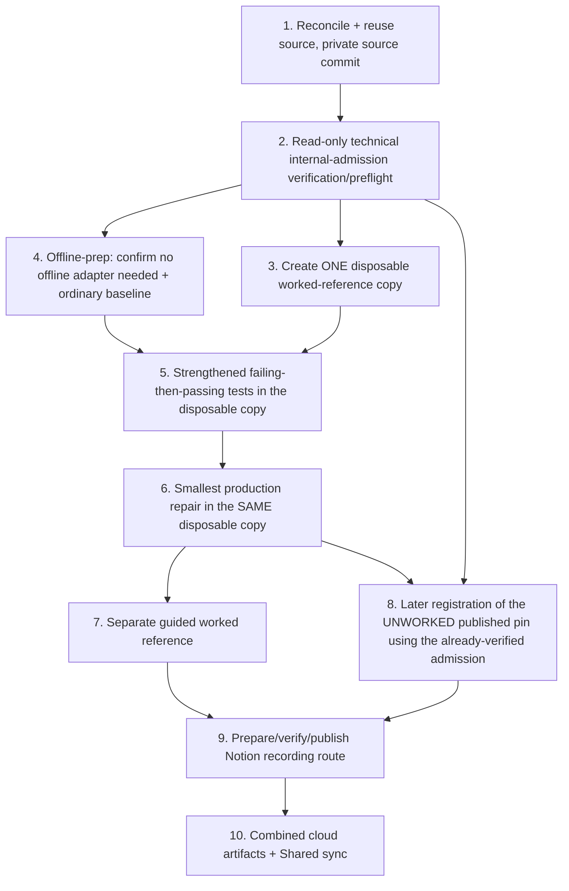

# Implementation Plan: JavaScript Signup Form Validation Regex Repair

## Overview

This is the FUTURE real implementation plan that runs ONLY after an actual Kiro review PASS and Ky's human merge of the new canonical 18-record spec PR to `main`. THIS Kiro session executes none of it — no code, no tests, no publication, no registration, no capture, no PASS. Each task reuses the UNCHANGED recovered unworked source (no duplicate build) and names a coder plus a DISTINCT reviewer.

## Task Dependency Graph



```json
{ "waves": [ { "wave": 1, "tasks": ["1"] }, { "wave": 2, "tasks": ["2"] }, { "wave": 3, "tasks": ["4", "3"] }, { "wave": 4, "tasks": ["5"] }, { "wave": 5, "tasks": ["6"] }, { "wave": 6, "tasks": ["7", "8"] }, { "wave": 7, "tasks": ["9"] }, { "wave": 8, "tasks": ["10"] } ] }
```

## Tasks

- [ ] 1. Reconcile and reuse the UNCHANGED unworked source; publish a full PRIVATE source commit
  - Coder: Codex / Reviewer: Cursor
  - Reuse `extractedRoot` starter at `starterSubdirectory` (cloud task `task_e_6ac6d5f886fc8322ae0ceab6e191f68b`, ready; `diffSha256` `89720c3ef31690572cb134fe568704153a2b9019c7981cf0ad364626c2da0e2d`; 10 files). Do NOT invent a new repo or source commit; do NOT re-create. Legacy issue #182 is historical only.
  - Traces: REQ-1, REQ-2, REQ-3.

- [ ] 2. Read-only technical internal-admission verification/preflight (BEFORE any world command/test/repair execution)
  - Coder: Cursor / Reviewer: Codex
  - Verify the bound internal admission read-only against the already-verified recovery/source/Goal evidence; NO world command, test, or repair runs before this preflight. This is internal technical evidence only — NOT a new Fit release, Recorder/pre-record decision, paid approval, or mastery flag.
  - Traces: REQ-1, REQ-5.

- [ ] 3. Create ONE private disposable worked-reference copy (AFTER the preflight)
  - Coder: Codex / Reviewer: Cursor
  - Create a single disposable worked-reference copy from the published unchanged source AFTER the admission preflight. Keep a SEPARATE ordinary-baseline copy and preserve the published/recovered/Recorder UNWORKED inputs. Tasks 5 and 6 operate on THIS SAME copy; never on the published unworked starter or Recorder workspace.
  - Traces: REQ-4.

- [ ] 4. Confirm no offline packaging adapter is required (offline prep + ordinary baseline, AFTER the preflight)
  - Coder: Cursor / Reviewer: Codex
  - Node built-ins only; no npm install, no fake requirements file, no network pip. Record Node 20.11+ floor and `node --test` / `node server.js` entrypoints.
  - Traces: REQ-5.

- [ ] 5. Write strengthened tests that FAIL before the repair and PASS after
  - Coder: Codex / Reviewer: Cursor
  - In the SAME disposable worked-reference copy from task 3, add decisive `node --test` rows: an INDEPENDENT plus-address case (literal `+` in the local part with an otherwise already-accepted TLD) AND an INDEPENDENT long-TLD case (alphabetic TLD longer than 4 letters, WITHOUT `+`); plus malformed phone with surrounding characters. Deterministic replay. Keep the ordinary baseline SEPARATE from the guided worked reference. No broader email/IANA policy; no human-choice claim.
  - Traces: REQ-4, REQ-1, REQ-2, REQ-3.

- [ ] 6. Apply the smallest production repair
  - Coder: Cursor / Reviewer: Codex
  - In the SAME disposable worked-reference copy, remove the `{2,4}` email TLD cap to the contract alphabetic >=2 rule (no upper cap) AND include a LITERAL plus `+` in the local-part character class (the source class omits it); anchor `phonePattern` end-to-end with `^...$`; preserve NO-TRIM / as-entered. Smallest change that turns the failing tests green, including the plus-address case.
  - Traces: REQ-1, REQ-2, REQ-3.

- [ ] 7. Record the separate manual browser verification + disposable guided reference
  - Coder: Codex / Reviewer: Cursor
  - Specify the `localhost:4173` manual check as distinct human evidence; keep any guided worked reference disposable and separate from the baseline.
  - Traces: REQ-6, REQ-4.

- [ ] 8. Later registration of the UNWORKED published pin, binding Source/Goal using the already-verified admission
  - Coder: Cursor / Reviewer: Codex
  - Bind registration to the verified Goal+LF hash and the recovered UNWORKED source, reusing the admission already verified at task 2 (no re-admission; no cyclic prerequisite on tasks 5/6). Preconditions: Kiro review PASS and Ky main merge (not Fit Gate release or paid approval).
  - Traces: REQ-1..REQ-6.

- [ ] 9. Prepare, verify, and publish the exact source/Goal-bound Notion recording route
  - Coder: Codex / Reviewer: Cursor
  - PREPARE and VERIFY the exact source/Goal-bound route with observed checkpoints, recovery, and narration, then PUBLISH the route steps. The VERIFIED separate disposable worked reference (task 7) precedes finalizing these route checkpoints. The actual manual capture is FUTURE HUMAN work and PENDING; it is NEVER agent-executed. No AI during actual capture.
  - Traces: REQ-6.

- [ ] 10. Produce combined cloud artifacts and Shared sync
  - Coder: Cursor / Reviewer: Codex
  - Assemble successful combined cloud artifacts and complete Shared sync ONLY AFTER actual successful proof and sync of the preceding tasks. No final 18-doc PASS is emitted here; the independent parent final-reviews the combined 54 docs at the committed HEAD.
  - Traces: REQ-4, REQ-6.

## Notes

- Paid acceptance is UNVERIFIED (neither eligible nor ineligible). Recorded Candidate/Fit Gate HOLD preserved as facts.
- No destructive operations, deploys, merges, or approvals by any agent.
