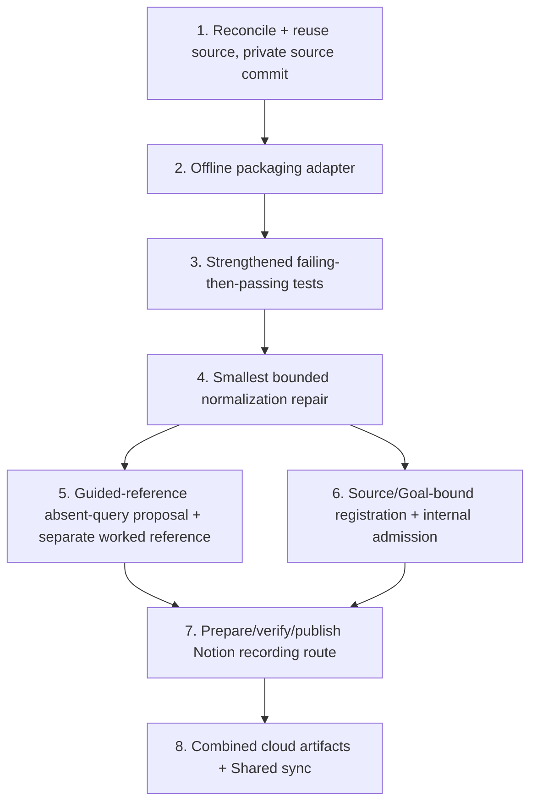

# Implementation Plan: Lambda Handler API Gateway Event-Shape Regression (Local Tests)

## Overview

This is the FUTURE real implementation plan that runs ONLY after an actual Kiro review PASS and Ky's human merge of the new canonical 18-record spec PR to `main`. THIS Kiro session executes none of it — no code, no tests, no publication, no registration, no capture, no PASS. Each task reuses the UNCHANGED recovered unworked source (no duplicate build) and names a coder plus a DISTINCT reviewer.

## Task Dependency Graph



```json
{ "waves": [ { "wave": 1, "tasks": ["1"] }, { "wave": 2, "tasks": ["2"] }, { "wave": 3, "tasks": ["3"] }, { "wave": 4, "tasks": ["4"] }, { "wave": 5, "tasks": ["5", "6"] }, { "wave": 6, "tasks": ["7"] }, { "wave": 7, "tasks": ["8"] } ] }
```

## Tasks

- [ ] 1. Reconcile and reuse the UNCHANGED unworked source; publish a full PRIVATE source commit
  - Coder: Codex / Reviewer: Cursor
  - Reuse `extractedRoot` starter at `starters/lambda-event-shape-regression` (cloud task `task_e_6ac6d2786b8c8322971aeb8206acf6eb`, ready; `diffSha256` `ce2045dd8c2685dc99c45320825c1613225a93ba6e705c3429c9cd5a876af4fa`; 9 files). Do NOT invent a new repo/source commit; do NOT re-create. PR #42 and issue #169 are historical only; the sole spec-merge gate is Ky's main merge of the new canonical 18-record spec PR.
  - Traces: REQ-1, REQ-2, REQ-3, REQ-4.

- [ ] 2. Add the reviewed offline packaging adapter (real metadata gap)
  - Coder: Codex / Reviewer: Cursor
  - Supply `pytest>=8,<9` via reviewed `pyproject` metadata / prepared wheels and an explicit offline `--no-index` cache/helper. No fake `requirements-dev.txt`; no network pip. Cached-pytest, no editable install.
  - Traces: REQ-5.

- [ ] 3. Write strengthened tests that FAIL before the repair and PASS after
  - Coder: Cursor / Reviewer: Codex
  - Add v1 and v2 fixture cases plus the absent-query case; assert the read-from-source status/body for 200/404/405 and the proposed absent-query response. Reproduce the v2 `KeyError` first. Deterministic replay; baseline kept SEPARATE from any guided worked reference.
  - Traces: REQ-1, REQ-2, REQ-3.

- [ ] 4. Apply the smallest bounded normalization repair
  - Coder: Codex / Reviewer: Cursor
  - Add a bounded normalization layer mapping both shapes to a common internal `{ method, query }`; handle absent query. Confine the change; do not rewrite handler logic. Smallest change that turns the failing tests green.
  - Traces: REQ-1, REQ-2, REQ-4.

- [ ] 5. Record the guided-reference absent-query proposal + disposable worked reference
  - Coder: Cursor / Reviewer: Codex
  - State the AI-designed absent-query response proposal for Ky's batch-PR review (preserve 200/404/405; propose bounded absent-query). Keep any worked reference disposable and separate. Do not claim a human decided.
  - Traces: REQ-2, REQ-3.

- [ ] 6. Exact source/Goal-bound registration and internal admission
  - Coder: Codex / Reviewer: Cursor
  - Bind registration to the verified Goal+LF hash and the recovered source; perform bound internal admission. Preconditions: Kiro review PASS and Ky main merge (not Fit Gate release or paid approval).
  - Traces: REQ-1..REQ-5.

- [ ] 7. Prepare, verify, and publish the exact source/Goal-bound Notion recording route
  - Coder: Codex / Reviewer: Cursor
  - PREPARE and VERIFY the exact source/Goal-bound route with observed checkpoints, recovery, and narration, then PUBLISH the route steps. The VERIFIED separate disposable worked reference (task 5) precedes finalizing these route checkpoints. The actual manual capture is FUTURE HUMAN work and PENDING; it is NEVER agent-executed. No AI during actual capture.
  - Traces: REQ-3.

- [ ] 8. Produce combined cloud artifacts and Shared sync
  - Coder: Cursor / Reviewer: Codex
  - Assemble successful combined cloud artifacts and complete Shared sync ONLY AFTER actual successful proof and sync of the preceding tasks. No final 18-doc PASS is emitted here; the independent parent final-reviews the combined 54 docs at the committed HEAD.
  - Traces: REQ-3, REQ-5.

## Notes

- Paid acceptance is UNVERIFIED (neither eligible nor ineligible). Recorded Candidate/Fit Gate HOLD preserved as facts.
- PR #42 is a closed-unmerged historical reusable draft; not reopened or merged.
- No destructive operations, deploys, merges, or approvals by any agent.
