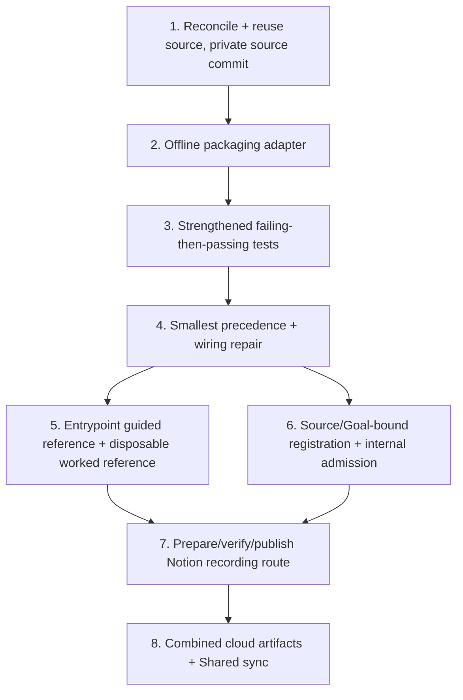

# Implementation Plan: Python CLI Configuration Precedence Bug Fix

## Overview

This is the FUTURE real implementation plan that runs ONLY after an actual Kiro review PASS and Ky's human merge of the new canonical 18-record spec PR to `main`. THIS Kiro session executes none of it — no code, no tests, no publication, no registration, no capture, no PASS. Each task reuses the UNCHANGED recovered unworked source (no duplicate build) and names a coder plus a DISTINCT reviewer.

## Task Dependency Graph



```json
{ "waves": [ { "wave": 1, "tasks": ["1"] }, { "wave": 2, "tasks": ["2"] }, { "wave": 3, "tasks": ["3"] }, { "wave": 4, "tasks": ["4"] }, { "wave": 5, "tasks": ["5", "6"] }, { "wave": 6, "tasks": ["7"] }, { "wave": 7, "tasks": ["8"] } ] }
```

## Tasks

- [ ] 1. Reconcile and reuse the UNCHANGED unworked source; publish a full PRIVATE source commit
  - Coder: Codex / Reviewer: Cursor
  - Reuse `extractedRoot` starter at `starters/python-cli-configuration-precedence` (cloud task `task_e_6ac6cf4a80048322aa762d7aa8e4adcd`, ready; `diffSha256` `a6452d65e7c1b987e28ba5900a0c21c69acf00b2825e2749c3d163c6ccb3acfd`; 11 files). Do NOT invent a new repo/source commit; do NOT re-create. Issue #155 is historical only; the sole spec-merge gate is Ky's main merge of the new canonical 18-record spec PR.
  - Traces: REQ-1, REQ-2, REQ-3, REQ-4.

- [ ] 2. Add the reviewed offline packaging adapter (real metadata gap)
  - Coder: Codex / Reviewer: Cursor
  - Supply `pytest>=8,<9` via reviewed `pyproject` metadata / prepared wheels and an explicit offline `--no-index` cache/helper. No fake `requirements-dev.txt`; no network pip. `PYTHONPATH=src` for tests.
  - Traces: REQ-7.

- [ ] 3. Write strengthened tests that FAIL before the repair and PASS after
  - Coder: Cursor / Reviewer: Codex
  - Add the parametrized conflict matrix and empty-env rows plus live command runs; assert each source wins only when it should. Deterministic replay; baseline kept SEPARATE from any guided worked reference.
  - Traces: REQ-6, REQ-1, REQ-2, REQ-3, REQ-4.

- [ ] 4. Apply the smallest precedence + empty-env repair
  - Coder: Codex / Reviewer: Cursor
  - Reorder `load_settings` to flag > non-empty-env > config > default; treat empty-string env as unset. `load_settings` already accepts `environ` (defaulting to `os.environ`) and `main()` already calls it, so do NOT invent new environment wiring. Keep unknown-arg and explicitly-selected-missing-config error behavior unchanged. Smallest change that turns the failing tests green.
  - Traces: REQ-1, REQ-2, REQ-3, REQ-4.

- [ ] 5. State the existing-entrypoint guided reference + disposable worked reference
  - Coder: Cursor / Reviewer: Codex
  - State the faithful offline live entrypoint as the existing-entrypoint guided-reference proposal `PYTHONPATH=src python -m waypoint_cli` (via `__main__.py`), grounded in authoritative `docs/behavior.md`; note the recorded `python -m waypoint_cli.cli` no-op. Leave no on-camera entrypoint choice and do not claim an editable install worked. Keep any worked reference disposable and separate from the baseline.
  - Traces: REQ-5.

- [ ] 6. Exact source/Goal-bound registration and internal admission
  - Coder: Codex / Reviewer: Cursor
  - Bind registration to the verified Goal+LF hash and the recovered source; perform bound internal admission. Preconditions: Kiro review PASS and Ky main merge (not Fit Gate release or paid approval).
  - Traces: REQ-1..REQ-7.

- [ ] 7. Prepare, verify, and publish the exact source/Goal-bound Notion recording route
  - Coder: Codex / Reviewer: Cursor
  - PREPARE and VERIFY the exact source/Goal-bound route with observed checkpoints, recovery, and narration, then PUBLISH the route steps. The VERIFIED separate disposable worked reference (task 5) precedes finalizing these route checkpoints. The actual manual capture is FUTURE HUMAN work and PENDING; it is NEVER agent-executed. No AI during actual capture.
  - Traces: REQ-6.

- [ ] 8. Produce combined cloud artifacts and Shared sync
  - Coder: Cursor / Reviewer: Codex
  - Assemble successful combined cloud artifacts and complete Shared sync ONLY AFTER actual successful proof and sync of the preceding tasks. No final 18-doc PASS is emitted here; the independent parent final-reviews the combined 54 docs at the committed HEAD.
  - Traces: REQ-6, REQ-7.

## Notes

- Paid acceptance is UNVERIFIED (neither eligible nor ineligible). Recorded Candidate/Fit Gate HOLD preserved as facts.
- No destructive operations, deploys, merges, or approvals by any agent.
