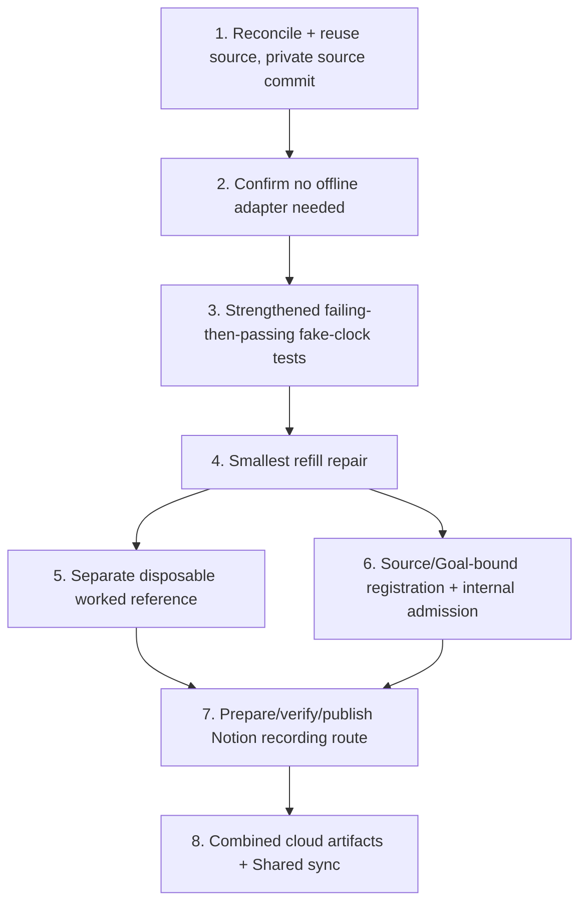

# Implementation Plan: Token-Bucket Rate Limiter Burst Bug Fix

## Overview

This is the FUTURE real implementation plan that runs ONLY after an actual Kiro review PASS and Ky's human merge of the new canonical 18-record spec PR to `main`. THIS Kiro session executes none of it — no code, no tests, no publication, no registration, no capture, no PASS. Each task reuses the UNCHANGED recovered unworked source (no duplicate build) and names a coder plus a DISTINCT reviewer.

## Task Dependency Graph



```json
{ "waves": [ { "wave": 1, "tasks": ["1"] }, { "wave": 2, "tasks": ["2"] }, { "wave": 3, "tasks": ["3"] }, { "wave": 4, "tasks": ["4"] }, { "wave": 5, "tasks": ["5", "6"] }, { "wave": 6, "tasks": ["7"] }, { "wave": 7, "tasks": ["8"] } ] }
```

## Tasks

- [ ] 1. Reconcile and reuse the UNCHANGED unworked source; publish a full PRIVATE source commit
  - Coder: Codex / Reviewer: Cursor
  - Reuse `extractedRoot` starter at `bootcamp/token-bucket-rate-limiter` (cloud task `task_e_6ac6d5fffbf483228e2111a2956bd9d7`, ready; `diffSha256` `cc432614f0dcfa728df956ced448d00e5bf1278e3c473ef5aa9b3ae3755fa092`; 9 files). Do NOT invent a new repo/source commit; do NOT re-create. Issue #186 is historical only; the sole spec-merge gate is Ky's main merge of the new canonical 18-record spec PR.
  - Traces: REQ-1, REQ-2, REQ-3, REQ-4.

- [ ] 2. Confirm no offline packaging adapter is required
  - Coder: Cursor / Reviewer: Codex
  - Python standard library only; tests run with `PYTHONPATH=src`, no editable install, no fake requirements file, no network pip. Note `compileall` as disposable-only.
  - Traces: REQ-5.

- [ ] 3. Write strengthened fake-clock tests that FAIL before the repair and PASS after
  - Coder: Codex / Reviewer: Cursor
  - Add idle→burst and fractional-refill scenarios using `tests/fakes.py`; reproduce the over-capacity burst first; assert capacity cap, configured rate, and preserved backward-time rejection. Deterministic replay; baseline kept SEPARATE from any guided worked reference.
  - Traces: REQ-1, REQ-2, REQ-3, REQ-4, REQ-5.

- [ ] 4. Apply the smallest refill repair
  - Coder: Cursor / Reviewer: Codex
  - In `_refill`, compute fractional refill (no `int(elapsed)` truncation) and cap `_tokens` at capacity; preserve the injectable clock and backward-time rejection. Smallest change that turns the failing tests green.
  - Traces: REQ-1, REQ-2, REQ-3, REQ-4.

- [ ] 5. Record the separate disposable worked reference
  - Coder: Codex / Reviewer: Cursor
  - Keep any guided worked reference disposable and separate from the ordinary baseline; note `examples/observe_limiter.py` observation.
  - Traces: REQ-5.

- [ ] 6. Exact source/Goal-bound registration and internal admission
  - Coder: Cursor / Reviewer: Codex
  - Bind registration to the verified Goal+LF hash and the recovered source; perform bound internal admission. Preconditions: Kiro review PASS and Ky main merge (not Fit Gate release or paid approval).
  - Traces: REQ-1..REQ-5.

- [ ] 7. Prepare, verify, and publish the exact source/Goal-bound Notion recording route
  - Coder: Codex / Reviewer: Cursor
  - PREPARE and VERIFY the exact source/Goal-bound route with observed checkpoints, recovery, and narration, then PUBLISH the route steps. The VERIFIED separate disposable worked reference (task 5) precedes finalizing these route checkpoints. The actual manual capture is FUTURE HUMAN work and PENDING; it is NEVER agent-executed. No AI during actual capture.
  - Traces: REQ-5.

- [ ] 8. Produce combined cloud artifacts and Shared sync
  - Coder: Cursor / Reviewer: Codex
  - Assemble successful combined cloud artifacts and complete Shared sync ONLY AFTER actual successful proof and sync of the preceding tasks. No final 18-doc PASS is emitted here; the independent parent final-reviews the combined 54 docs at the committed HEAD.
  - Traces: REQ-3, REQ-5.

## Notes

- Paid acceptance is UNVERIFIED (neither eligible nor ineligible). Recorded Candidate/Fit Gate HOLD preserved as facts.
- No destructive operations, deploys, merges, or approvals by any agent.
