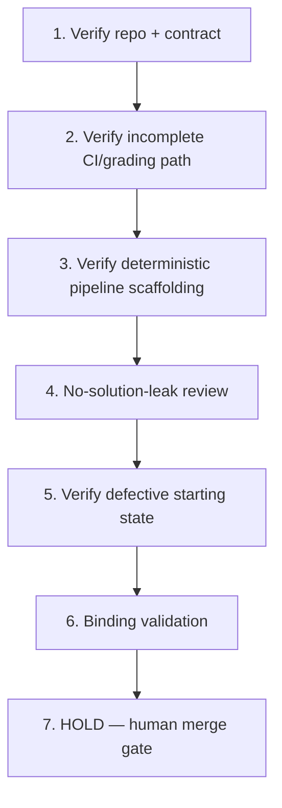

# Implementation Plan: CI Evaluation Contract Transfer Repair

## Overview

This plan is a Kiro spec review/enhancement in local session sess_ef9c3844-0570-409c-baa6-7cc73d898476 of a spec originally prepared under a prior owner/process. The pinned starter already exists at commit `ca532d92ec3db02224061b3ceef105b2bc113b27`; the construction steps below are HISTORICAL and already satisfied at that pin. They are relabeled as verification-only and MUST NOT rebuild or reseed the pin. Governing invariant INV-1 is preserved. Each task has a coder and a different reviewer and traces to requirement IDs. No prior authorship is claimed.

## Tasks

1. **Verify (historical, already satisfied at pin): synthetic grading repository and written contract** (R1, R2, R4)
   - Assigned coder: **Codex**
   - Reviewer: **Cursor**
   - Confirm neutral fabricated grading requirements and a valid fixture. Reuse the pinned source unchanged; do not rebuild or reseed.

2. **Verify (historical, already satisfied at pin): the intentionally incomplete starter CI/grading path** (R3, R6; INV-1)
   - Assigned coder: **Codex**
   - Reviewer: **Cursor**
   - Confirm a bounded contract-to-enforcement gap exists and the final fix is not labeled.

3. **Verify (historical, already satisfied at pin): deterministic local pipeline scaffolding** (R7, R8)
   - Assigned coder: **Codex**
   - Reviewer: **Cursor**
   - Confirm the valid case and unrelated checks run locally (`Ran 3 tests`; `sample_001: 3`).

4. **No-solution-leak review** (R9, R10)
   - Assigned coder: **Cursor**
   - Reviewer: **Codex**
   - Confirm there is no completed fail-closed validation, final negative fixture, diagnosis note, or answer-key diff.

5. **Verify (historical, already satisfied at pin): defective starting state** (R5, R10)
   - Assigned coder: **Codex**
   - Reviewer: **Cursor**
   - Confirm the repo is ready for TaskRecorder with the approved human work still undone. This is technical SOURCE verification only; human capture admission remains separately pending (no completed Recorder/pre-record gates).

6. **Binding validation (no duplication)** (R-provenance; AC2, AC3)
   - Assigned coder: **Cursor**
   - Reviewer: **Codex**
   - Downstream registration/scripts MUST bind the exact Source SHA (`ca532d92ec3db02224061b3ceef105b2bc113b27`), the verbatim Goal, these requirements, INV-1, and the actual verified baseline output (`Ran 3 tests`; `sample_001: 3`). Reuse the existing prep registry/helper/publisher/learning-map/paired GHA artifacts and the existing Notion row (3f08621e0a7a81b49fd3f290ce5e6d8b). Never duplicate trackers or jobs.

7. **HOLD — human merge gate (final)**
   - All coding and source promotion are HELD until Ky merges the eventual specs-only PR with green required checks (repo CI + `ai-governance / verdict`). Agents never merge, approve, deploy, or promote source. Human diagnosis/repair/recording/attempt/approval/pay remain human-owned.

## Task Dependency Graph



```json
{
  "waves": [
    ["1"],
    ["2"],
    ["3"],
    ["4"],
    ["5"],
    ["6"],
    ["7"]
  ]
}
```

## Notes

- Construction verbs in historical tasks (1–3, 5) are verification-only against the existing pin; never rebuild or reseed.
- Coder/reviewer are always distinct: Codex codes and Cursor reviews on construction/verification tasks; Cursor codes and Codex reviews on review and binding-validation tasks.
- INV-1 is preserved and carried in the design `## Correctness Properties`.
- SOURCE PASS at this stage is technical only; it does not establish Odin paid approval, completed capture, or human mastery. The current intended mode is guided practice; a separate future unaided Transfer Test is a distinct assessment, not part of this spec or guided world prep.
