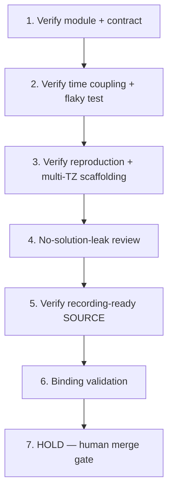

# Implementation Plan: Flaky Time-Dependent Test Stabilization via Clock Injection

## Overview

This plan is a Kiro spec review/enhancement in local session sess_ef9c3844-0570-409c-baa6-7cc73d898476 of a spec originally prepared under a prior owner/process. The pinned starter already exists at commit `e5652bcb044cd24d2a7d1c2f8bb93b885cea2069`; the construction steps below are HISTORICAL and already satisfied at that pin. They are relabeled as verification-only and MUST NOT rebuild or reseed the pin. Each task has a coder and a different reviewer and traces to requirement IDs. No prior authorship is claimed.

## Tasks

1. **Verify (historical, already satisfied at pin): synthetic Python time-sensitive module and behavior contract** (R1, R2, R4)
   - Assigned coder: **Codex**
   - Reviewer: **Cursor**
   - Reuse the pinned source unchanged; do not rebuild or reseed.

2. **Verify (historical, already satisfied at pin): direct system-clock/local-time coupling and a flaky starter test** (R2, R3)
   - Assigned coder: **Codex**
   - Reviewer: **Cursor**
   - Confirm the eventual injected-clock design remains absent.

3. **Verify (historical, already satisfied at pin): safe reproduction and multi-TZ scaffolding** (R5, R8, R10)
   - Assigned coder: **Codex**
   - Reviewer: **Cursor**
   - Confirm time/TZ sensitivity is demonstrable without waiting for real time; confirm no final fixed-timestamp assertions.
   - PLANNED (Requirement 10, criterion 1): during actual permitted technical verification, record each provided reproduction/repeat command's elapsed duration and check it finishes within the 60-second limit. This is a planned measurement, not a result asserted by this spec pass (nothing executed here).

4. **No-solution-leak review** (R7, R9)
   - Assigned coder: **Cursor**
   - Reviewer: **Codex**
   - Confirm there is no clock injection, final boundary suite, diagnosis note, or ready-to-paste answer in recorder-visible files.

5. **Verify (historical, already satisfied at pin): starter is recording-ready SOURCE** (R1, R10)
   - Assigned coder: **Codex**
   - Reviewer: **Cursor**
   - Confirm the project is in the deliberately time-dependent starting state. This is technical SOURCE verification only; human capture admission remains separately pending (no completed Recorder/pre-record gates, no unaided-mastery claim).

6. **Binding validation (no duplication)** (Introduction Source/Goal bindings; Requirement 3, criterion 2; Requirement 5, criterion 1)
   - Assigned coder: **Cursor**
   - Reviewer: **Codex**
   - Downstream registration/scripts MUST bind the exact Source SHA (`e5652bcb044cd24d2a7d1c2f8bb93b885cea2069`), the verbatim Goal, these requirements, and the actual verified baseline output (`Ran 1 test`; `Timezone outcomes:`). Reuse the existing prep registry/helper/publisher/learning-map/paired GHA artifacts and the existing Notion row (3f08621e0a7a813289fde5cad87aba40). Never duplicate trackers or jobs.

7. **HOLD — human merge gate (final)**
   - All coding and source promotion are HELD until Ky merges the eventual specs-only PR with green required checks (repo CI + `ai-governance / verdict`). Agents never merge, approve, deploy, or promote source. Human diagnosis/repair/recording/attempt/approval/pay remain human-owned.

## Task Dependency Graph



```json
{
  "waves": [
    ["1"],
    ["2"],
    ["3"],
    ["4"],
    ["5"],
    ["6"],
    ["7"]
  ]
}
```

## Notes

- Construction verbs in historical tasks (1–3, 5) are verification-only against the existing pin; never rebuild or reseed.
- Coder/reviewer are always distinct: Codex codes and Cursor reviews on construction/verification tasks; Cursor codes and Codex reviews on review and binding-validation tasks.
- SOURCE PASS at this stage is technical only; it does not establish Odin paid approval, completed capture, or unaided human mastery.
