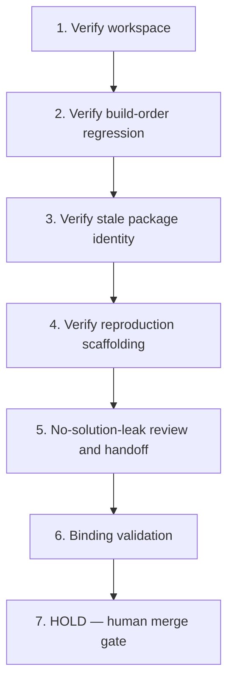

# Implementation Plan: Monorepo Build-Graph Regression Repair

## Overview

This plan is a Kiro spec review/enhancement in local session sess_ef9c3844-0570-409c-baa6-7cc73d898476 of a spec originally prepared under a prior owner/process. The pinned starter already exists at commit `2ddf3c8f2a0e054ea2e40ab077c5a48132c34a38`; the construction steps below are HISTORICAL and already satisfied at that pin. They are relabeled as verification-only and MUST NOT rebuild or reseed the pin. Each task has a coder and a different reviewer and traces to requirement IDs. No prior authorship is claimed.

## Tasks

1. **Verify (historical, already satisfied at pin): synthetic pnpm/Turborepo workspace** (R1, R2, R8)
   - Assigned coder: **Codex**
   - Reviewer: **Cursor**
   - Confirm the affected service, shared dependency, and one unrelated workspace check. Reuse the pinned source unchanged; do not rebuild or reseed.

2. **Verify (historical, already satisfied at pin): the transitive build-order regression** (R3, R4, R7)
   - Assigned coder: **Codex**
   - Reviewer: **Cursor**
   - Confirm the shared dependency requires its own build output while the starter service path fails to establish the needed build relationship.

3. **Verify (historical, already satisfied at pin): the stale package-identity configuration** (R5, R7)
   - Assigned coder: **Codex**
   - Reviewer: **Cursor**
   - Confirm the obsolete name is present in a realistic build/container/config surface and that the repair is not written.

4. **Verify (historical, already satisfied at pin): deterministic reproduction scaffolding** (R6, R10)
   - Assigned coder: **Codex**
   - Reviewer: **Cursor**
   - Confirm dependency installation and the single failing service build command are documented.

5. **No-solution-leak review and handoff** (R9, R10)
   - Assigned coder: **Cursor**
   - Reviewer: **Codex**
   - Confirm neither final correction nor completed verification note is present; the failing starter remains ready for recording. This is technical SOURCE verification only; human capture admission remains separately pending (no completed Recorder/pre-record gates).

6. **Binding validation (no duplication)** (R-provenance; AC2, AC3, AC4)
   - Assigned coder: **Cursor**
   - Reviewer: **Codex**
   - Downstream registration/scripts MUST bind the exact Source SHA (`2ddf3c8f2a0e054ea2e40ab077c5a48132c34a38`), the verbatim Goal, these requirements, and the actual verified baseline output (`status check passed`; `packages/route-core/dist/routes.json`; `container target @harbor/dispatch-api is not a workspace package`). Reuse the existing prep registry/helper/publisher/learning-map/paired GHA artifacts and the existing Notion row (3f08621e0a7a818f8a72f73e8d4e4da0). Never duplicate trackers or jobs.

7. **HOLD — human merge gate (final)**
   - All coding and source promotion are HELD until Ky merges the eventual specs-only PR with green required checks (repo CI + `ai-governance / verdict`). Agents never merge, approve, deploy, or promote source. Human diagnosis/repair/recording/attempt/approval/pay remain human-owned.

## Task Dependency Graph



```json
{
  "waves": [
    ["1"],
    ["2"],
    ["3"],
    ["4"],
    ["5"],
    ["6"],
    ["7"]
  ]
}
```

## Notes

- Construction verbs in historical tasks (1–4) are verification-only against the existing pin; never rebuild or reseed.
- Coder/reviewer are always distinct: Codex codes and Cursor reviews on construction/verification tasks; Cursor codes and Codex reviews on review and binding-validation tasks.
- SOURCE PASS at this stage is technical only; it does not establish Odin paid approval, completed capture, or human mastery. The current intended mode is guided practice; a separate future unaided Transfer Test is a distinct assessment, not part of this spec or guided world prep.
