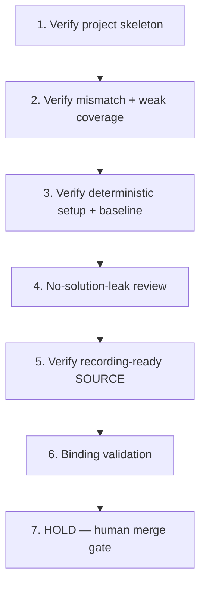

# Implementation Plan: Vacuous Test Suite Audit

## Overview

This plan is a Kiro spec review/enhancement in local session sess_ef9c3844-0570-409c-baa6-7cc73d898476 of a spec originally prepared under a prior owner/process. The pinned starter already exists at commit `c5986e93719cfd4b08a57104576c04a78d1f16ee`; the construction steps below are HISTORICAL and already satisfied at that pin. They are relabeled as verification-only and MUST NOT rebuild or reseed the pin. Each task has a coder and a different reviewer and traces to requirement IDs. No prior authorship is claimed.

## Tasks

1. **Verify (historical, already satisfied at pin): synthetic project skeleton** (R1, R2, R9)
   - Assigned coder: **Codex**
   - Reviewer: **Cursor**
   - Confirm the neutral Python package, behavior document, pytest configuration, and baseline run instructions. Reuse the pinned source unchanged; do not rebuild or reseed.

2. **Verify (historical, already satisfied at pin): one bounded behavioral mismatch and weak passing coverage** (R3, R4)
   - Assigned coder: **Codex**
   - Reviewer: **Cursor**
   - Confirm the implementation violates the written contract while the starter tests still pass; confirm the final strengthened assertions and corrective patch remain absent.

3. **Verify (historical, already satisfied at pin): deterministic setup and baseline verification** (R5, R8)
   - Assigned coder: **Codex**
   - Reviewer: **Cursor**
   - Confirm a short local command/script proves the initial suite is green (`8 passed`) from the defective starting state. PLANNED read-only verification SHALL also confirm the Requirement 8 criterion 2 behavior: that setup and baseline are deterministic/local and network-free after the pinned dependencies are installed into `.venv`. This is a planned read-only check, not executed by this spec pass.

4. **Perform no-solution-leak review** (R7, R10)
   - Assigned coder: **Cursor**
   - Reviewer: **Codex**
   - Confirm recorder-visible files contain no diagnosis, answer key, strengthened final test, or completed fix.

5. **Verify (historical, already satisfied at pin): starter is recording-ready SOURCE** (R1, R9, R10)
   - Assigned coder: **Codex**
   - Reviewer: **Cursor**
   - Confirm the repository is in the defective, weak-test starting state documenting only setup/baseline commands. This is technical SOURCE verification only; human capture admission remains separately pending (no completed Recorder/pre-record gates).

6. **Binding validation (no duplication)** (Introduction Source/Goal bindings; Requirement 4, criterion 1)
   - Assigned coder: **Cursor**
   - Reviewer: **Codex**
   - Downstream registration/scripts MUST bind the exact Source SHA (`c5986e93719cfd4b08a57104576c04a78d1f16ee`), the verbatim Goal, these requirements, and the actual verified baseline output (`8 passed`). Reuse the existing prep registry/helper/publisher/learning-map/paired GHA artifacts and the existing Notion row (3f08621e0a7a81eda36bdd125c60221c). Never duplicate trackers or jobs.

7. **HOLD — human merge gate (final)**
   - All coding and source promotion are HELD until Ky merges the eventual specs-only PR with green required checks (repo CI + `ai-governance / verdict`). Agents never merge, approve, deploy, or promote source. Human diagnosis/repair/recording/attempt/approval/pay remain human-owned.

## Task Dependency Graph



```json
{
  "waves": [
    ["1"],
    ["2"],
    ["3"],
    ["4"],
    ["5"],
    ["6"],
    ["7"]
  ]
}
```

## Notes

- Construction verbs in historical tasks (1–3, 5) are verification-only against the existing pin; never rebuild or reseed.
- Coder/reviewer are always distinct: Codex codes and Cursor reviews on construction/verification tasks; Cursor codes and Codex reviews on review and binding-validation tasks.
- SOURCE PASS at this stage is technical only; it does not establish Odin paid approval, completed capture, or human mastery. The current intended mode is guided practice; a separate future unaided Transfer Test is a distinct assessment, not part of this spec or guided world prep.
